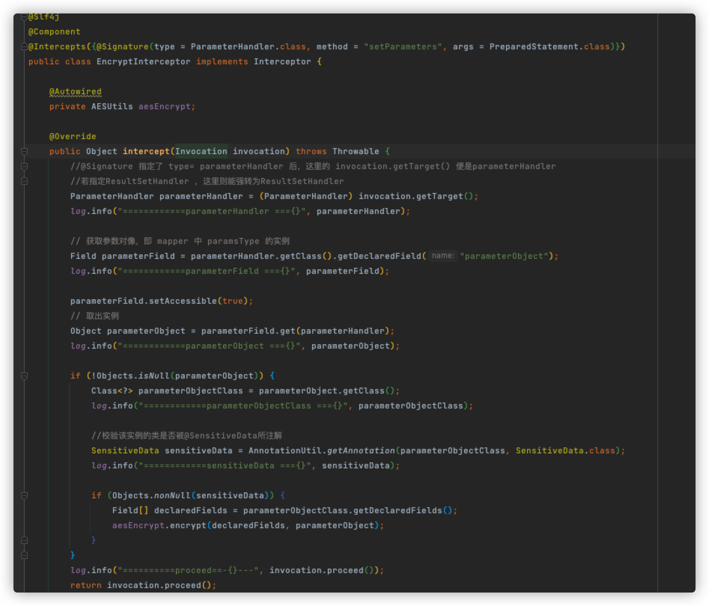
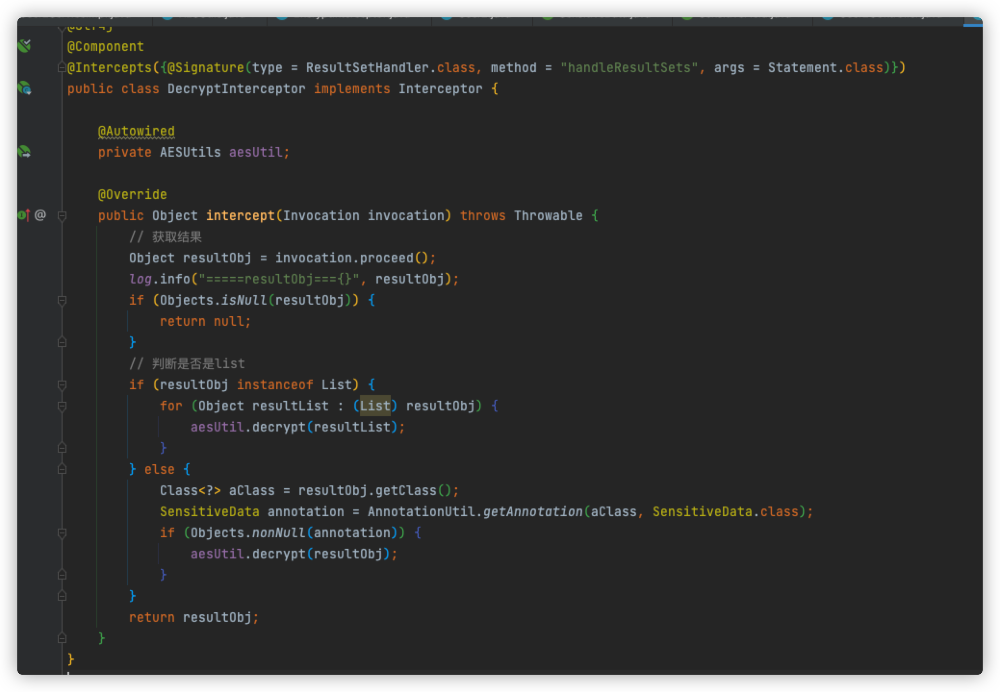
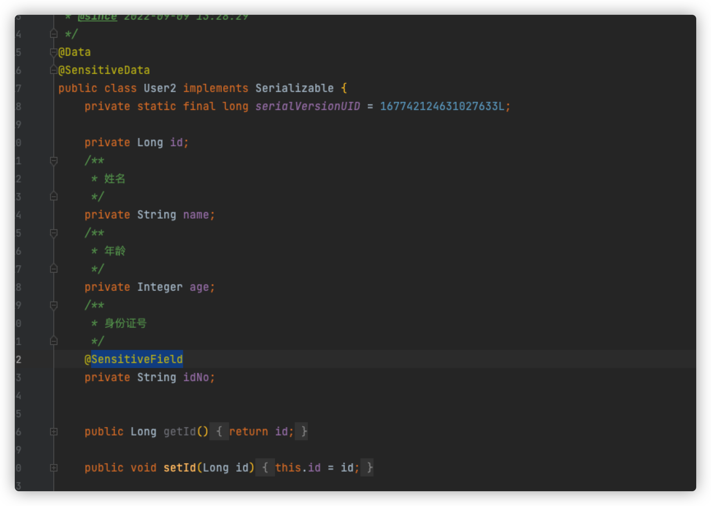
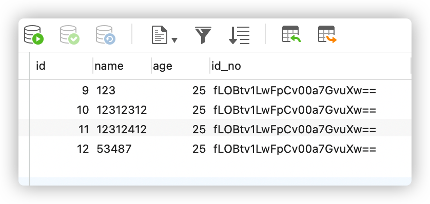
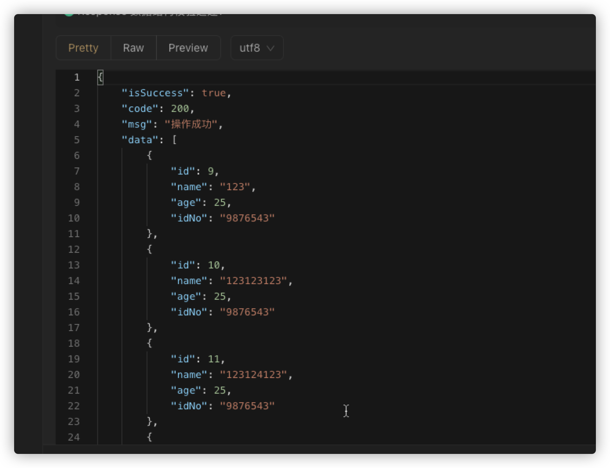

# 关于mybatis数据存储的加密、解密


背景：在大部分的系统中，出于用户的隐私安全考虑，都会对数据库内容进行加密，那么在编写业务代码逻辑时加密也不太现实。于是通用的加解密插件就应运而生，本文将采用mybatis的拦截器作为基础进行实现。


思路：我们可以通过mybatis的拦截器进行参数的加密和解密

- Executor (update, query, flushStatements, commit, rollback, getTransaction, close, isClosed)  // 拦截执行方法
- ParameterHandler (getParameterObject, setParameters)                                                           // 拦截参数处理器
- ResultSetHandler (handleResultSets, handleOutputParameters)                                               // 拦截结果集处理器
- StatementHandler (prepare, parameterize, batch, update, query)                                              // 拦截sql构建处理器

1. 两个注解，一个用于实体类（SensitiveData），一个用于实体类的字段（SensitiveField）
2. 重写mysql的拦截器Interceptor，对数据进行加密和解密


- 加密：（拦截参数处理器）

```java
@Intercepts({@Signature(type = ParameterHandler.class, method = "setParameters", args = PreparedStatement.class)})
```

```java
public Object intercept(Invocation invocation) throws Throwable {
    //@Signature 指定了 type= parameterHandler 后，这里的 invocation.getTarget() 便是parameterHandler
    //若指定ResultSetHandler ，这里则能强转为ResultSetHandler
    ParameterHandler parameterHandler = (ParameterHandler) invocation.getTarget();
    log.info("============parameterHandler ==={}", parameterHandler);

    // 获取参数对像，即 mapper 中 paramsType 的实例
    Field parameterField = parameterHandler.getClass().getDeclaredField("parameterObject");
    log.info("============parameterField ==={}", parameterField);

    parameterField.setAccessible(true);
    // 取出实例
    Object parameterObject = parameterField.get(parameterHandler);
    log.info("============parameterObject ==={}", parameterObject);

    if (!Objects.isNull(parameterObject)) {
        Class<?> parameterObjectClass = parameterObject.getClass();
        log.info("============parameterObjectClass ==={}", parameterObjectClass);

        //校验该实例的类是否被@SensitiveData所注解
        SensitiveData sensitiveData = AnnotationUtil.getAnnotation(parameterObjectClass, SensitiveData.class);
        log.info("============sensitiveData ==={}", sensitiveData);

        if (Objects.nonNull(sensitiveData)) {
            Field[] declaredFields = parameterObjectClass.getDeclaredFields();
            aesEncrypt.encrypt(declaredFields, parameterObject);
        }
    }
    log.info("==========proceed==-{}---", invocation.proceed());
    return invocation.proceed();
}
```





- 解密

  ```java
  @Intercepts({@Signature(type = ResultSetHandler.class, method = "handleResultSets", args = Statement.class)})
  ```

```java
public Object intercept(Invocation invocation) throws Throwable {
    // 获取结果
    Object resultObj = invocation.proceed();
    log.info("=====resultObj==={}", resultObj);
    if (Objects.isNull(resultObj)) {
        return null;
    }
    // 判断是否是list
    if (resultObj instanceof List) {
        for (Object resultList : (List) resultObj) {
            aesUtil.decrypt(resultList);
        }
    } else {
        Class<?> aClass = resultObj.getClass();
        SensitiveData annotation = AnnotationUtil.getAnnotation(aClass, SensitiveData.class);
        if (Objects.nonNull(annotation)) {
            aesUtil.decrypt(resultObj);
        }
    }
    return resultObj;
}
```






# 结果：

存储：



查询：

